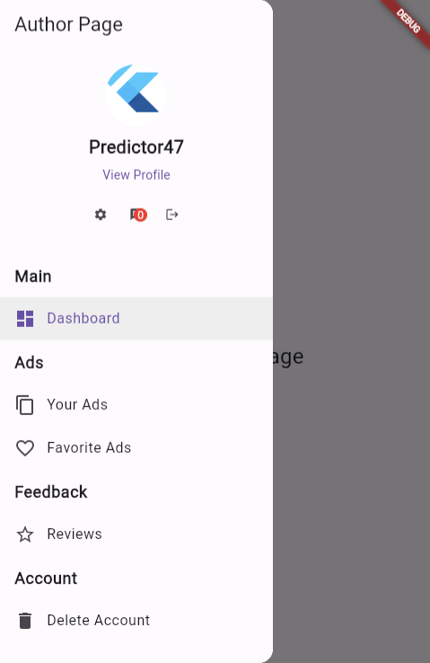

# flutter-sidebar-demo

This Flutter application demonstrates the implementation of a responsive sidebar for easy navigation within the application.

## Features

- **Sidebar Navigation:** Easily navigate between different sections of the app using the sidebar menu.
- **User Profile:** Display user details, including an avatar, username, and a link to view the profile.
- **Settings and Messages:** Access settings, view messages, and see the count of unread messages.
- **Logout:** Log out from the application.

## Screenshots


*Main Page - The main page of the app showcasing a clean interface with an empty white background.*


*Author Page - The author page displaying user details, including an avatar, username (Predictor47), and options for settings, messages, and logout.*

## Getting Started

1. Clone the repository:

   ```bash
   git clone https://github.com/predictor47/flutter-sidebar-demo.git

2. Navigate to the project directory:

    bash
    Copy code
    cd flutter-sidebar-demo
3. Run the app:

    bash
    Copy code
    flutter run
# Dependencies
    Flutter: A UI toolkit for building natively compiled applications for mobile, web, and desktop from a single codebase.
    Contributing

# Contributions are welcome! If you find any issues or have suggestions for improvements, please open an issue or create a pull request.

# License
    This project is licensed under the MIT License - see the LICENSE file for details.

    Feel free to customize the README further based on your project structure, additional features, or any specific instructions for contributors. The descriptions for the screenshots have been added for your convenience.


